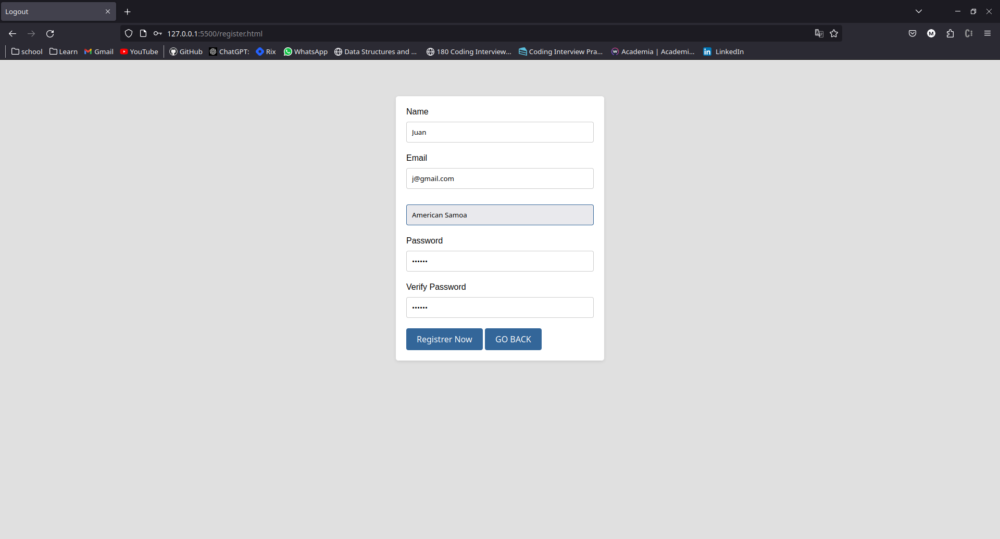
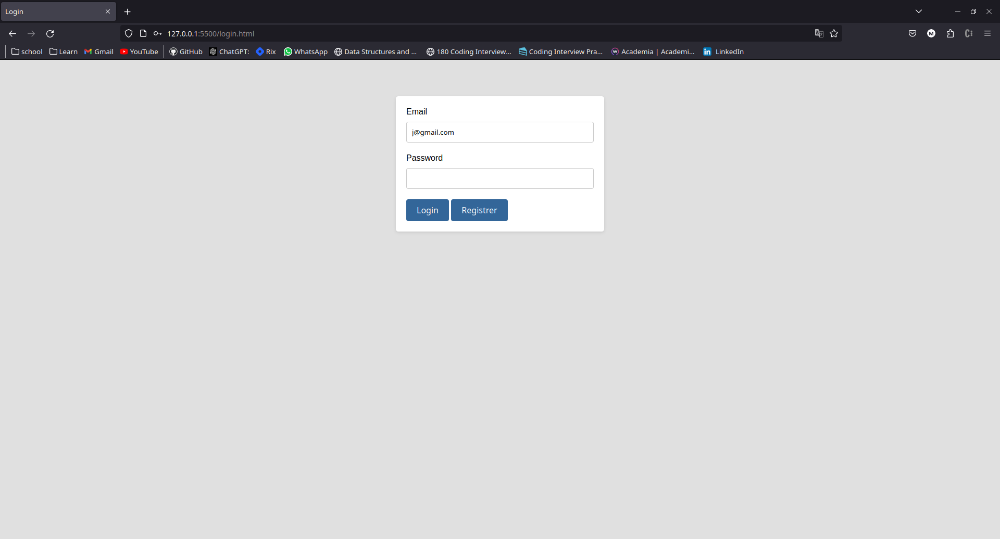
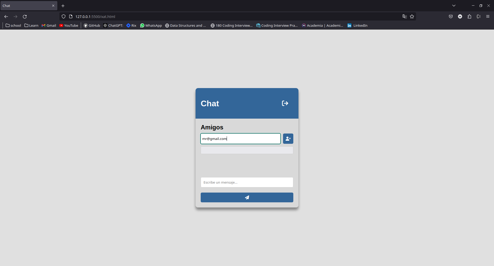
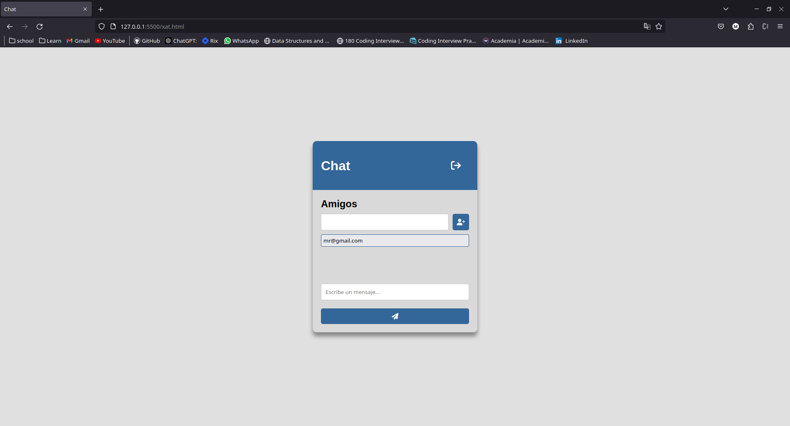
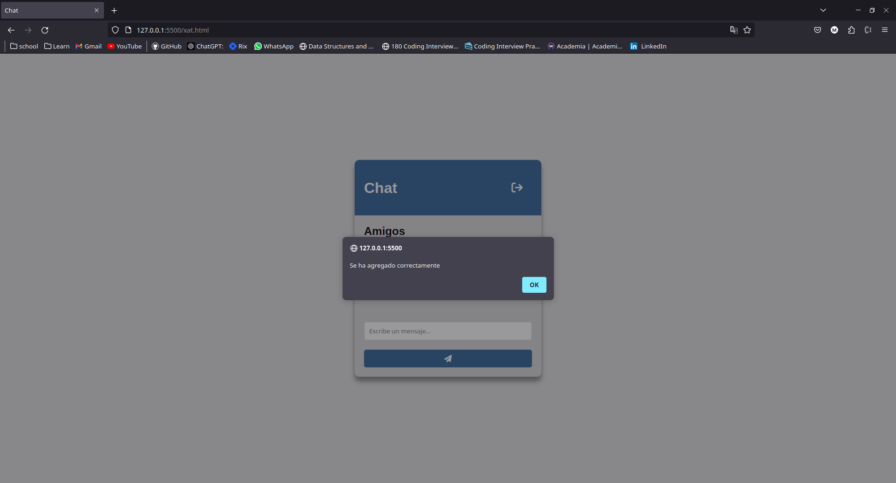
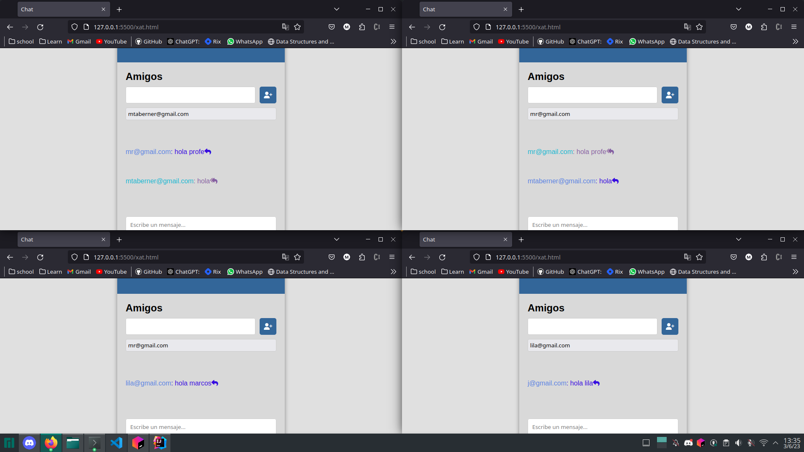
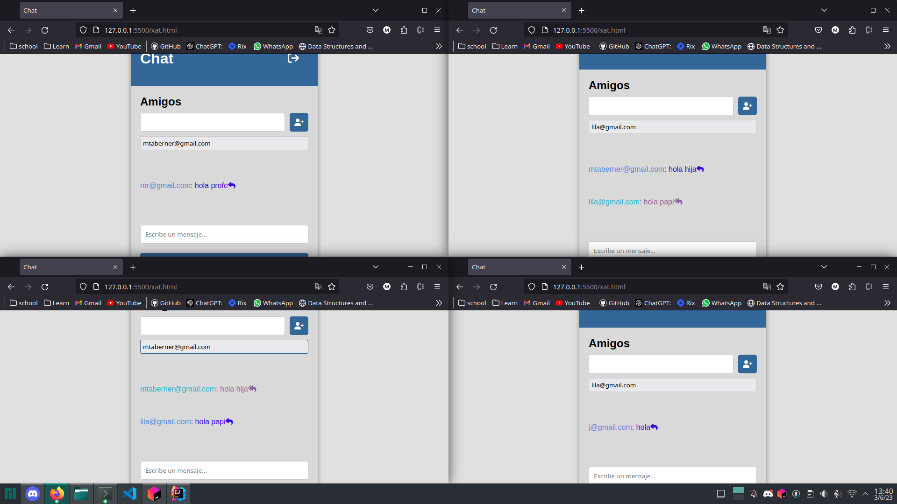
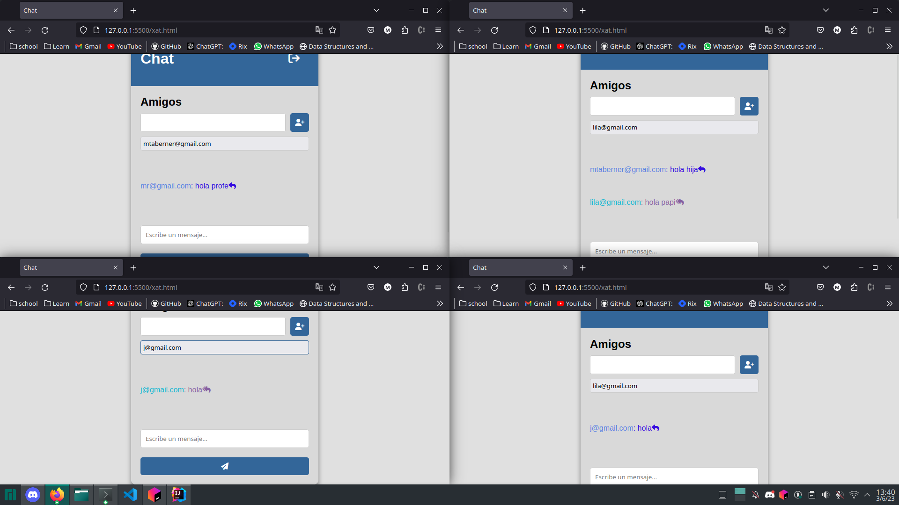

# Proyecto Final
# Titulo : "Chat"
# Descripcion:
El objetivo que se busca con este proyecto es simular el comportamiento de un chat.Debemos ser capaces de solucionar los requerimientos que nos han sido planteados por nuestro profesor,siendo estos los siguientes:
1. Login
2. Registro
  - Crear un select con la lista de países, esta la recibiremos del backend en formato json.
3. Agregar amigo
4. Recibir lista de amigos
5. Enviar mensaje
6. Recibir mensaje

```Requisito funcional: Debemos ser capaces de tener abiertas más de 4 conversaciones , los usuarios deben poder cambiar entre chats sin perder los mensajes.```

# Solución de los requerimientos:
## 1 : Login
```js
function doLogin() {
  var rhttp = new XMLHttpRequest();
  let mail = document.getElementById("mail").value;
  let pass = document.getElementById("password").value;

  rhttp.onreadystatechange = function () {
	if (this.readyState == 4 && this.status == 200) {
  	let data = rhttp.responseText;
  	if (data != "false") {
    	console.log(rhttp.responseText);
    	sessionStorage.setItem("session", data);
    	sessionStorage.setItem("mail", document.getElementById("mail").value);
    	location.href = "xat.html";
  	} else {
    	alert("The user or pass don't exist");
  	}
	}
  };

  let url = "mail=" + mail + "&pass=" + pass;
  rhttp.open(
	"GET",
	"http://localhost:8080/XatLLM_war_exploded/Login?" + url,
	true
  );
  rhttp.send();
}
```
Enviamos mediante el metodo get del protocolo http el mail y el password del usuario que desea loguearse, recibiremos "false" en caso de no existir dicho usuario en la base de datos.

## 2 : Registro
### Primero comprobamos que esté escribiendo bien la password y si tiene una longitud superior a 6 dígitos:
```js
function verify_password() {
  let password1 = document.getElementById("password1").value;
  let password2 = document.getElementById("password2").value;

  if (password1 != password2) {
	alert("Las contraseñas no coinciden");
  } else if (password1.length < 6) {
	alert("La contraseña debe tener al menos 6 caracteres");
  } else {
	regsitrarUsuario();
  }
}
```
### Luego invocamos a resgistrarUsuario en caso de ser correctas la passwords:
```js
function regsitrarUsuario() {
  let ehttp = new XMLHttpRequest();
  let user = document.getElementById("name").value;
  let mail = document.getElementById("mail").value;
  let codeCountry = document.getElementById("countries").value;
  let pass = document.getElementById("password1").value;

  console.log(codeCountry);
  ehttp.onreadystatechange = function () {
	if (this.readyState == 4 && this.status == 200) {
  	location.href = "login.html";
  	sessionStorage.setItem("mail", document.getElementById("mail").value);
	}
  };

  let url =
	"mail=" +
	mail +
	"&pass=" +
	pass +
	"&user=" +
	user +
	"&codeCountry=" +
	codeCountry;

  ehttp.open("POST", "http://localhost:8080/XatLLM_war_exploded/Register");
  ehttp.setRequestHeader("Content-type", "application/x-www-form-urlencoded");
  ehttp.send(url);
}
```
### Requerimiento especial : Recibir paises como json  y colocarlos en un select:
```js
function getCountries() {
  let rhttp = new XMLHttpRequest();

  rhttp.onreadystatechange = function () {
	if (this.readyState == 4 && this.status == 200) {
  	let data = JSON.parse(rhttp.responseText);
  	let selectElement = document.getElementById("countries");
  	selectElement.innerHTML = ""; // empty select
  	console.log(data[3]);
  	for (let i = 0; i < data.length; i++) {
    	let option = document.createElement("option");
    	option.value = data[i].code;
    	option.textContent = data[i].name;
    	selectElement.appendChild(option);
  	}
  	console.log(data);
	}
  };
  let url = "";

  rhttp.open(
	"GET",
	"http://localhost:8080/XatLLM_war_exploded/Register?" + url,
	true
  );
  rhttp.send();
}
```
## 3 :  Agregar amigo
```js
function agregarAmigo() {
  let rhttp = new XMLHttpRequest();
  let mail = sessionStorage.getItem("mail");
  let session = sessionStorage.getItem("session");
  let friendMail = document.getElementById("friendMail").value;

  rhttp.onreadystatechange = function () {
	if (this.readyState == 4 && this.status == 200) {
  	let data = rhttp.responseText;
  	console.log(data);
  	recibirListaDeAmigos();
  	switch (data) {
    	case "0":
      	alert("El servidor no responde");
      	break;
    	case "1":
      	document.getElementById("friendMail").value = "";
      	alert("Se ha agregado correctamente");
      	break;
    	case "2":
      	alert("No se encuentra al amigo especificado");
      	break;

    	case "3":
      	alert("El código de sesión ha expirado debe loguearse nuevamente");
      	break;
  	}
	}
  };

  let url = "mail=" + mail + "&session=" + session + "&friend=" + friendMail;
  console.log(url);

  rhttp.open("POST", "http://localhost:8080/XatLLM_war_exploded/Friend", true);
  rhttp.setRequestHeader("Content-type", "application/x-www-form-urlencoded");
  rhttp.send(url);
}
```
Un vez ha sido agregado el amigo se recibe la lista de nuestros amigos automáticamente

## 4 : Recibir lista de amigos
```js
function recibirListaDeAmigos() {
  let ehttp = new XMLHttpRequest();
  let mail = sessionStorage.getItem("mail");
  let session = sessionStorage.getItem("session");
  console.log(mail + " " + session);

  ehttp.onreadystatechange = function () {
	if (this.readyState == 4 && this.status == 200) {
  	let data = JSON.parse(ehttp.responseText);
  	let selectElement = document.getElementById("receptor");
  	selectElement.innerHTML = "";
  	console.log(data[0]);
  	for (let i = 0; i < data.length; i++) {
    	let option = document.createElement("option");
    	option.value = data[i];
    	option.textContent = data[i];
    	selectElement.appendChild(option);
  	}
	}
  };

  let url = "mail=" + mail + "&session=" + session;

  ehttp.open(
	"GET",
	"http://localhost:8080/XatLLM_war_exploded/Friend?" + url,
	true
  );
  ehttp.send();
}
```
## 5 : Enviar mensaje
```js
unction enviarMensaje() {
  let ehttp = new XMLHttpRequest();
  let mail = sessionStorage.getItem("mail");
  let session = sessionStorage.getItem("session");
  let receptor = document.getElementById("receptor").value;
  let sms = document.getElementById("sms").value;

  if (!(receptor in con.conversaciones)) {
	iniciarConversacion();
	insertarMensaje(
  	mail,
  	sms,
  	receptor,
  	"emisorText",
  	"emisorTextSpan",
  	"fa-solid fa-reply"
	);
  } else {
	insertarMensaje(
  	mail,
  	sms,
  	receptor,
  	"emisorText",
  	"emisorTextSpan",
  	"fa-solid fa-reply"
	);
  }

  ehttp.onreadystatechange = function () {
	if (this.readyState == 4 && this.status == 200) {
  	document.getElementById("sms").value = "";
	}
  };

  let url =
	"mail=" +
	mail +
	"&session=" +
	session +
	"&receptor=" +
	receptor +
	"&sms=" +
	sms;

  ehttp.open("POST", "http://localhost:8080/XatLLM_war_exploded/Xat", true);
  ehttp.setRequestHeader("Content-type", "application/x-www-form-urlencoded");
  ehttp.send(url);
}
```
## 6 : Recibir mensaje
```js
function recibirMensaje() {
  let rhttp = new XMLHttpRequest();
  let mail = sessionStorage.getItem("mail");
  let session = sessionStorage.getItem("session");
  console.log(mail);
  console.log(session);

  rhttp.onreadystatechange = function () {
	if (this.readyState == 4 && this.status == 200) {
  	let data = JSON.parse(rhttp.responseText);

  	if (data.emisor in con.conversaciones) {
    	insertarMensaje(
      	data.emisor,
      	data.text,
      	data.emisor,
      	"recibido",
      	"recibidoTextSpan",
      	"fa-solid fa-reply-all"
    	);
  	} else {
    	con.crearChat(data.emisor);
    	document.getElementById(data.emisor).style.display = "none";
    	insertarMensaje(
      	data.emisor,
      	data.text,
      	data.emisor,
      	"recibido",
      	"recibidoTextSpan",
      	"fa-solid fa-reply-all"
    	);
  	}

  	recibirMensaje();
	}
  };

  let url = "mail=" + mail + "&session=" + session;
  console.log(url);

  rhttp.open(
	"GET",
	"http://localhost:8080/XatLLM_war_exploded/Xat?" + url,
	true
  );
  rhttp.send();
}
```

## Tanto para el método "recibirMensaje" y "enviarMensaje" implementamos la función insertar mensaje:
```js
function insertarMensaje(mail, sms, receptor, idP, idSpan, classNameI) {
  let span = document.createElement("span");
  let i = document.createElement("i");
  let p = document.createElement("p");
  let br = document.createElement("br");
  i.className = classNameI;
  p.id = idP;
  span.id = idSpan;
  span.innerHTML = mail;
  p.append(span, ": ", sms);
  p.append(i);
  document.getElementById(receptor).append(p);
  document.getElementById(receptor).append(br);
}
```
# Pruebas funcionales:
## Registro:

## Login


## Chat


## Insertando amigo




## Chat
## Marcos - Miquel



## Miquel - Lila



## Lila - Juan



## Lila conserva mensajes con miquel


